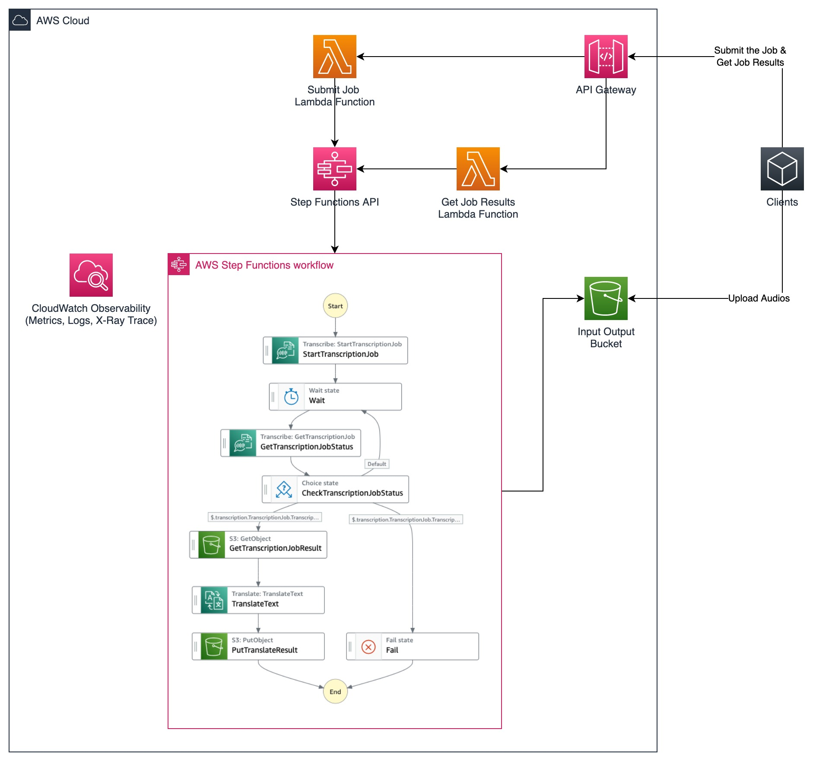

# AWS CDK Transcribe Translate Serverless Workflow

This repository provides a sample reference for a solution using AWS AI Services to convert speech audio into text with a different language. Currently, the solution is configured to accept an English audio and convert it into Bahasa Indonesia text transcript. However, it can be easily configured into another languages that is supported by both Amazon Transcribe and Amazon Translate.

The following is the architecture diagram:

In order to achieve the results, the solution uses Amazon Transcribe to convert the speech-to-text and Amazon Translate to translate the transcript text from the original language into the target language.

Since both Amazon Transcribe and Amazon Translate is provided as a service accessed through the API, the solution uses AWS Step Functions to create a serverless workflow to encapsulate both services into a single execution. The workflow also uses an S3 bucket as the audio input location and text output location.

Additionally, in order to test the solution, the workflow is exposed to the clients using Amazon API Gateway and AWS Lambda which provides the APIs to submit the job by executing the workflow and also get the results of the job. The results of the job will include the original transcribed audio and also the translation results.

AWS Step Functions is integrated with Amazon CloudWatch to provide full observability capability which includes metrics, logs, and traces (using AWS X-Ray).

___

## Deployment Prerequisites
1. Install and configure AWS CLI with your IAM user: https://aws.amazon.com/cli/
2. Install CDK: https://docs.aws.amazon.com/cdk/v2/guide/getting_started.html#getting_started_install

## Deployment Steps
1. Go to this directory `cd src/cdk` and then run `npm install`.
2. Run `cdk bootstrap` (You only need to perform this once).
3. Run `cdk deploy` to deploy this solution.

## Usage
1. The client upload the audio file to S3.
2. The client can submit the job to POST / with `videoKey` in the request body. `videoKey` is the location of the audio file in the s3 bucket. The API response will contains `executionId` for the asynchronous execution.
3. The client can then get the job results at GET / with the `executionId`.

___

## Teardown
You should consider deleting the application infrastructure once you no longer need it to save costs. Use `cdk destroy` to delete the CDK application.